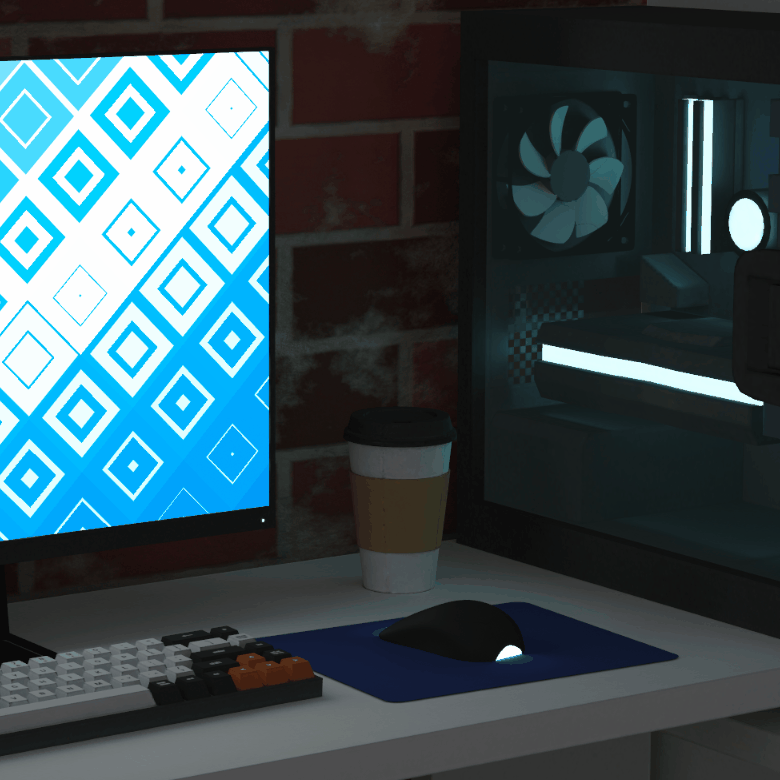

# blakesimpson.dev

[](https://app.netlify.com/sites/<NETLIFY_SITE_NAME>/deploys)


[](LICENSE)

A 3D portfolio in TypeScript using three.js, live at
[blakesimpson.dev](https://blakesimpson.dev). Clicking objects on the desk opens
the Music, Projects, About and Contact pages.



## How it works

- **Baked scene:** modelled in Blender, with lighting baked into two 4096²
  textures (`baked_room`, `baked_objects`). The model is a Draco-compressed glTF
  drawn with unlit `MeshBasicMaterial`, so there are no real-time lights.
- **Camera:** the camera moves are Blender clips (`CameraActionNLA1-5`) played
  through drei `useAnimations`. Clicking an object plays the clip for its page,
  and returning Home plays it in reverse.
- **Post-processing:** hover outline plus brightness/contrast via
  `@react-three/postprocessing`.
- **Monitor:** a DOM UI placed on the screen with drei `<Html transform>`. Its
  File menu switches the screen between a GLSL shader and project videos
  (`VideoTexture`). The Gameboy screen on the Music page works the same way.
- **Content:** page text, projects, tracks and monitor items live in
  `src/content/*.json`, with Markdown for rich text. `src/content/types.ts`
  describes each file, so `npm run typecheck` catches a malformed edit.
- **Contact:** the form is handled by Netlify Forms.

## Performance

Tuned for integrated GPUs: device pixel ratio capped at 1.5, MSAA at 2 samples,
no SSAO. These query switches in `src/constants/render_quality.ts` help compare
cost against quality:

- `?stats` - FPS / frame time panel
- `?dpr=2` - max device pixel ratio
- `?msaa=8` - EffectComposer MSAA samples

Desktop only for now (viewport of at least 1280px).

## Build and run

Requires Node 22 (see `.nvmrc`).

```sh
npm install
npm run dev
```

The dev server runs on http://localhost:3000. Netlify builds with
`npm run build` and publishes `build/`.

## Scripts

| Script                    | Purpose                                                |
| ------------------------- | ------------------------------------------------------ |
| `dev` / `start`           | Vite dev server                                        |
| `build`                   | Production build into `build/`                         |
| `preview`                 | Serve the production build locally                     |
| `typecheck`               | `tsc --noEmit`                                         |
| `lint`                    | ESLint: Google TypeScript Style, React, hooks          |
| `format` / `format:check` | Prettier (gts config) write / check                    |

The code follows the
[Google TypeScript Style Guide](https://google.github.io/styleguide/tsguide.html);
the rules ESLint can check are in `eslint.config.js`.

## Credits

The code is MIT licensed (see [LICENSE](LICENSE)). The 3D model, textures,
images, videos and music are © Blake Simpson, all rights reserved.

Built with [three.js](https://threejs.org) and pmndrs'
[react-three-fiber](https://github.com/pmndrs/react-three-fiber),
[drei](https://github.com/pmndrs/drei) and
[postprocessing](https://github.com/pmndrs/postprocessing). The baking workflow
comes from [Three.js Journey](https://threejs-journey.com) by Bruno Simon. The
monitor shader is based on
["Pretty Hip"](https://www.shadertoy.com/view/XsBfRW) on Shadertoy.

## Contact

blakesimpson.dev@outlook.com
